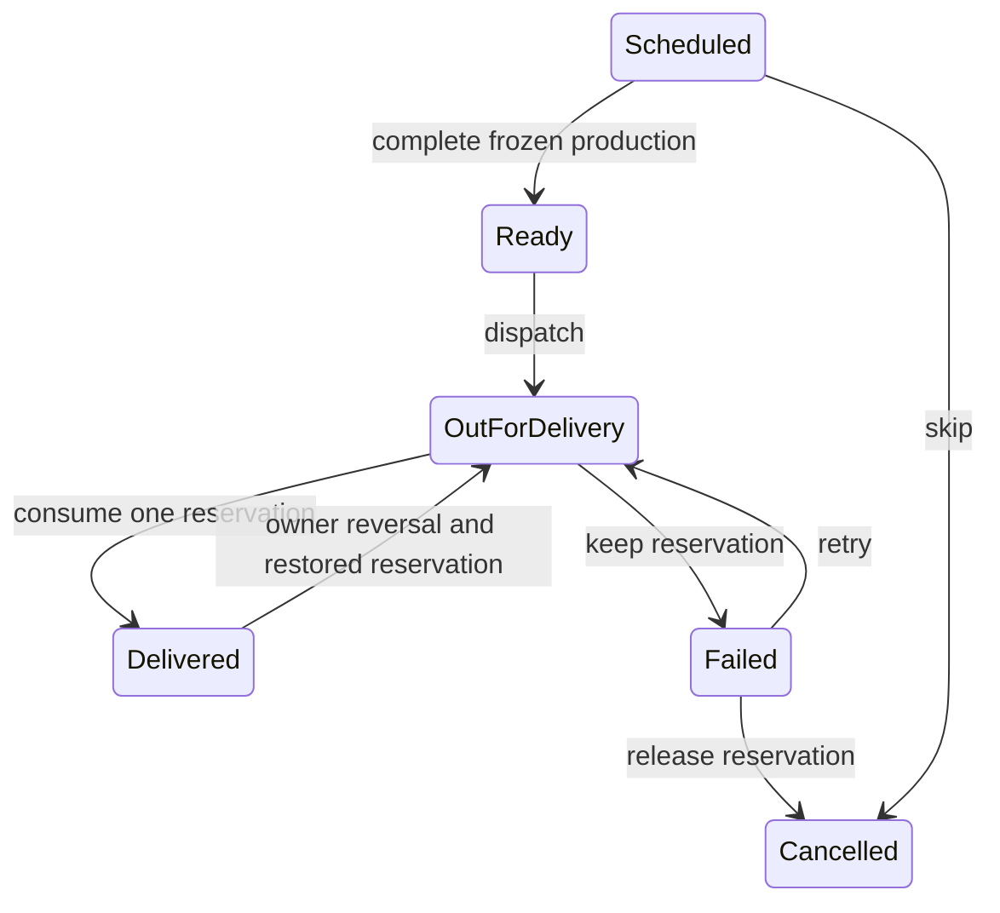

# Implementation baseline

Implemented from the approved September 2026 plan. Historical planning-only and troubleshooting instructions in the original handoff remain reference material; the current implementation request supersedes them.

## Structure

One Next.js App Router application serves both roles. Server actions validate Zod inputs, verify the current user, invoke database RPCs with the caller's identity, and invalidate tenant UI data. Tenant slugs select context; database membership establishes authority. The browser receives only the authorized workspace snapshot. It refreshes on focus and every 30 seconds while visible; successful changes refresh immediately and announce an in-app confirmation.

| Location | Responsibility |
|---|---|
| `src/app/actions.ts`, `src/lib/auth.ts`, `src/proxy.ts` | Validated commands, OTP/session lifecycle, cookie refresh |
| `src/lib/data.ts`, `src/lib/types.ts` | Server access and application DTOs |
| `src/lib/database.generated.ts` | Generated database table, insert, update, and RPC types |
| `supabase/migrations/202609080001_core.sql` | Schema, tenant constraints, privileges, RLS, transactional commands, freezes and reconciliation |
| `src/components/operations.tsx`, `delivery-detail.tsx` | Daily delivery cycle and explicit changes/fulfillment |
| `src/components/records.tsx`, `settings.tsx` | Customers, packages, purchases, recurrence, menus and policies |
| `src/components/portal.tsx` | Subscriber overview, schedule, package and profile |
| `src/app/api/exports/[id]/route.ts` | Authorized immutable-version print/CSV delivery manifests |
| `src/lib/demo-db.ts`, `demo-seed.ts` | Explicit persistent synthetic environment |
| `scripts/provision.mjs`, `install-cron.sql`, `health-report.mjs` | Controlled onboarding and operational tools |

## Command boundary

`execute_command(business_slug, action, payload, request_id)` runs one database transaction. It locks the business row before checking membership, the idempotency receipt, versions and current eligibility. This deliberately serializes mutations **within** a caterer for a conservative pilot accounting boundary. Different caterers have independent locks. Database time uses `clock_timestamp()` after acquiring locks, so waiting requests cannot retain pre-cutoff permission.

Only authenticated callers may run application RPCs. Every privileged function sets an explicit search path. Direct client DML is revoked on all workflow/ledger tables; RLS further restricts the few tables exposed for direct reads. Composite foreign keys bind grants to purchases/customers, reservations to their delivery and grant, deliveries to tenant-owned menus/slots/patterns, and reversals to their tenant's original entries.

Commands use actor-scoped request UUIDs. Reusing a UUID with different input is rejected. Delivery and record edits carry expected versions; recurrence carries its pattern version. Commands commit reservation/ledger effects, delivery events, audit metadata and the successful receipt together. Purchase, schedule and delivery operations return the affected record or pattern and a quota summary. Failed commands return stable error codes; routine logs contain the action, code and request ID, never the payload or customer details.

Configuration publication (menu offerings, slots, date exceptions, business settings and access changes) also carries the expected business policy version. Concurrent stale configuration forms are rejected and must be reloaded before review.

## Entitlements and scheduling

Each external purchase snapshots its package terms and creates one quota grant. The append-only ledger stores grants, consumption, reversals and owner adjustments. Remaining is the ledger balance; reserved is the count of active reservations; available excludes reservations and grants currently outside validity. Future-starting purchases can still schedule service dates within their future validity; the current availability card remains zero until the start date.

Generation previews weekdays, slots and a bounded date range, then commits the full batch or rejects it. Allocation uses earliest expiry, purchase creation time, then ID. One active customer/date/slot occurrence is allowed. Cancelled occurrences remain tombstones: a regeneration never silently recreates a skip. A reviewed recurrence revision preserves retained deliveries and their choices/addresses, cancels only the removed unlocked future occurrences, releases their reservations, and atomically adds eligible new ones. It does not rewrite earlier or delivered history.

Rescheduling preserves the reservation's grant and checks source/target cutoffs, package validity, destination slot, duplicate and menu availability. Skip releases the reservation. Neither action extends validity. Profile address changes affect only future bookings; each existing delivery retains its snapshot until explicitly reviewed and changed.

## Fulfillment and production

Duplicate delivered confirmation is a no-op even with a fresh request ID. A mistaken confirmation is reversed with a compensating entry linked to its original debit, a reason, and a restored reservation. Operational status never changes on navigation, date selection or detail opening. Completion may be recorded late against an existing reservation after grant expiry.

The default cutoff is 21:00 on the preceding day in Asia/Jakarta. The business timezone and per-date exceptions produce stored cutoff instants. Settings changes affect unlocked work and cannot silently force it across an already elapsed cutoff. Closed dates cannot retain active bookings.

At cutoff, a published default is assigned to missing selections. Frozen versions retain customer, meal and address snapshots; an absent default creates an incomplete version and blocks readiness. A late admin edit requires a reason and first ensures that the original cutoff version exists. Changes to frozen production/dispatch information append a version and an explicit difference list. Normal fulfillment statuses do not alter the production version. Print/CSV outputs identify the service date, slot, revision and timestamp; CSV fields neutralize spreadsheet formulas and printable text is escaped.

## Release boundary and scale

The local demo uses the same migration/functions with a minimal local Auth shim. It proves application behavior, not hosted Auth delivery or deployed infrastructure. Supabase and Vercel configuration, a sender domain, private Git remote and a verified hosted backup restore are still external release work.

The current read model returns a tenant workspace snapshot, then filters and paginates operational lists in the browser. The recorded 10,000-delivery fixture produces a 6.2 MB response and ~1.3 second local database median. Introduce date/customer-scoped reads and server pagination before a larger deployment or substantial history growth. The benchmark is evidence about this implementation, not a product limit or confirmed business volume. Per-business write serialization is another deliberate pilot tradeoff to remeasure under realistic traffic.

The planned deferred commercial and integration features remain outside this pilot.
